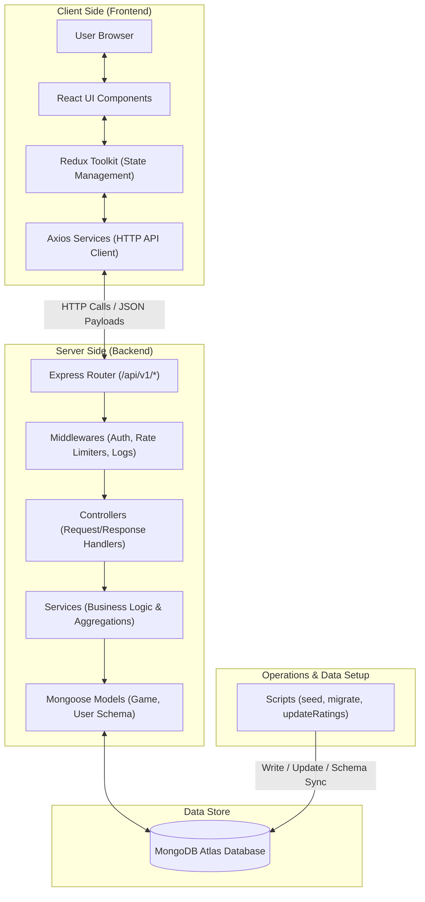

# Steam Games Dashboard // Technical Documentation

A full-stack, high-integrity dashboard system designed for indexing, auditing, and analyzing Steam-style game registry files.

This workspace consists of two separate, decoupled applications:
1. **`backend/`**: A RESTful API built on Express and MongoDB with JWT authentication.
2. **`frontend/`**: A brutalist-aesthetic analytics interface built on React, Redux Toolkit, and Vite.

---

## 🗺️ System Architecture & Data Flow



---

## 🛠️ Technology Stack

### Backend
* **Core Runtime**: Node.js (v18+)
* **Web Framework**: Express.js
* **Database**: MongoDB Atlas
* **ODM (Object Document Mapper)**: Mongoose (v8.8.x)
* **Security & Auth**:
  - JWT (JSON Web Tokens) for stateless authentication
  - bcryptjs (v2.4.x) for secure password hashing
  - express-rate-limit (v7.4.x) for request rate limiting
* **Logging**: Morgan (HTTP request logger)

### Frontend
* **Core Framework**: React (v19.x)
* **Build Tool & Dev Server**: Vite (v8.x)
* **State Management**: Redux Toolkit & React-Redux (v9.x)
* **Styling**: Vanilla CSS + Tailwind CSS (v4.x) for responsive layouts and custom retro-brutalist theme
* **UI Components**: Material Icons & `@mui/material` (v9.x)
* **HTTP Client**: Axios (v1.17.x)
* **Form Validation**: Formik (v2.x) & Yup (v1.x)
* **Notifications**: React Hot Toast

---

## 📂 Project Structure

```
Steam_Data/
├── backend/                       # REST API Backend
│   ├── server.js                  # Application entry point
│   ├── package.json               # Backend dependencies & npm scripts
│   ├── .env                       # Backend local configuration & credentials
│   ├── data/
│   │   └── sample-games.json      # Sample games dataset (5 entries)
│   └── src/
│       ├── config/
│       │   └── db.js              # Database connection configuration & fallbacks
│       ├── controllers/           # HTTP controllers handling requests/responses
│       │   ├── admin.controller.js
│       │   ├── analytics.controller.js
│       │   ├── auth.controller.js
│       │   └── game.controller.js
│       ├── middlewares/           # Auth validation, rate limiting, error catching
│       ├── models/                # Mongoose Database Models
│       │   ├── Game.js
│       │   └── User.js
│       ├── routes/                # Express API endpoints routing
│       ├── services/              # Database access, operations, and aggregation pipelines
│       └── scripts/               # Migration, seeding, and inspection scripts
│           ├── checkDb.js         # Raw database verification script
│           ├── migrateDb.js       # Main database schema migration script
│           ├── migrateDescriptions.js # Script to generate dynamic descriptions
│           ├── updateRatings.js   # Script to populate ratings & downloads
│           └── seedData.js        # Default database seeding script
│
└── frontend/                      # React Frontend Application
    ├── index.html                 # Document entry point
    ├── vite.config.js             # Vite dev server and API proxy setup
    ├── package.json               # Frontend dependencies & scripts
    └── src/
        ├── main.jsx               # React main rendering entry
        ├── App.jsx                # Main App component & routes container
        ├── assets/                # Layout and logo assets
        ├── components/            # Reusable UI components (cards, buttons, stat boxes)
        ├── hooks/                 # Custom React hooks (clock, auth status)
        ├── layouts/               # Dashboard and Auth wrappers
        ├── pages/                 # Full view pages (Registry, Analytics, Login)
        ├── routes/                # Protected and public route configuration
        ├── store/                 # Redux Toolkit global stores and slices
        └── services/              # Axios HTTP client endpoints configuration
```

---

## 🗄️ Database Schema

The database consists of two primary Mongoose collections: `users` and `games`.

### 1. User Schema (`User` Model)
Represents user accounts registered in the database.

| Field | Type | Validation / Constraints | Description |
|---|---|---|---|
| `name` | `String` | Required, Trimmed | Display name of the user |
| `email` | `String` | Required, Unique, Lowercase, Trimmed | User's unique login email |
| `password` | `String` | Required, Minlength: 6, `select: false` | Hashed password (hidden by default in queries) |
| `role` | `String` | Enum: `['admin', 'user']`, Default: `'user'` | Access control levels |
| `createdAt` | `Date` | Generated automatically by Mongoose | Timestamp of user creation |
| `updatedAt` | `Date` | Generated automatically by Mongoose | Timestamp of last modification |

### 2. Game Schema (`Game` Model)
Represents a Steam game record in the registry.

| Field | Type | Validation / Constraints | Description |
|---|---|---|---|
| `appid` | `Number` | Required, Unique, Indexed | Unique Steam numeric Application ID |
| `title` | `String` | Required, Trimmed | Game name/title |
| `description` | `String` | Trimmed | Brief summary/manifesto briefing of the game |
| `developer` | `String` | Trimmed | Creator/studio of the game |
| `publisher` | `String` | Trimmed | Publishing company |
| `genres` | `[String]` | Array, Trimmed elements | Genres representing the game (e.g. `Action`, `Indie`) |
| `tags` | `[String]` | Array, Trimmed elements | Tag labels based on Steam category features |
| `platforms` | `Object` | Nested Schema | Supported OS systems |
| `platforms.windows`| `Boolean`| Default: `false` | True if supported on Windows OS |
| `platforms.mac` | `Boolean` | Default: `false` | True if supported on macOS |
| `platforms.linux` | `Boolean` | Default: `false` | True if supported on Linux/SteamOS |
| `releaseDate` | `Date` | | Date the game was officially launched |
| `price` | `Number` | Min: 0, Default: `0` | Price of the game (USD) |
| `discount` | `Number` | Min: 0, Max: 100, Default: `0` | Active discount rate (percent) |
| `rating` | `Number` | Min: 0, Max: 10, Default: `0` | Rating score out of 10 |
| `downloads` | `Number` | Min: 0, Default: `0` | Total estimated downloads (yield) |
| `isFreeToPlay` | `Boolean` | Default: `false` | True if game cost is $0.00 |
| `isMultiplayer` | `Boolean` | Default: `false` | True if game supports multiplayer play |
| `isSingleplayer`| `Boolean` | Default: `false` | True if game supports singleplayer play |
| `isCoop` | `Boolean` | Default: `false` | True if game supports cooperative play |
| `hasControllerSupport`| `Boolean`| Default: `false` | True if game has full/partial controller support |
| `isVROnly` | `Boolean` | Default: `false` | True if game requires a VR headset |
| `isEarlyAccess` | `Boolean` | Default: `false` | True if game is currently in Early Access |
| `isArchived` | `Boolean` | Default: `false` | Soft-deletion flag (hidden from public endpoints) |
| `screenshots` | `[String]` | Array of image URLs | Preview screenshot links |
| `trailers` | `[String]` | Array of video URLs | Preview video/trailer links |
| `reviews` | `[Review]` | Array of review subdocuments | Embedded player review submissions |
| `updateHistory` | `[Update]` | Array of update subdocuments | Version and update history changelogs |

---

## 🚀 Running the Project Locally

### 1. Configure the Backend Environment
Create a file named `.env` in the `backend/` folder and populate it:
```env
PORT=5000
MONGO_URI=mongodb+srv://<username>:<password>@cluster0.trkwqdl.mongodb.net/steam_games_db?retryWrites=true&w=majority
JWT_SECRET=steam_games_super_secret_2026
JWT_EXPIRES_IN=7d
NODE_ENV=development
```

### 2. Start the Backend Server
```bash
cd backend
npm install
npm run dev
```
The server will start on `http://localhost:5000`.

### 3. Start the Frontend
```bash
cd frontend
npm install
npm run dev
```
The client app will launch on `http://localhost:5173`. Any API calls to `/api/v1/*` will be automatically proxied to `http://localhost:5000`.
